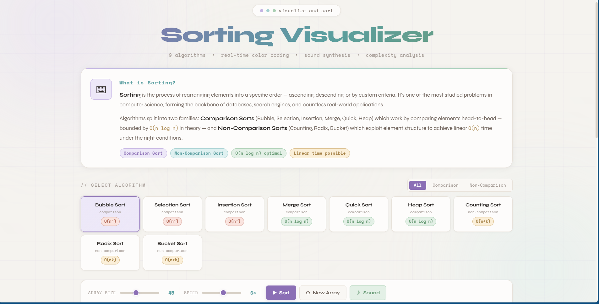
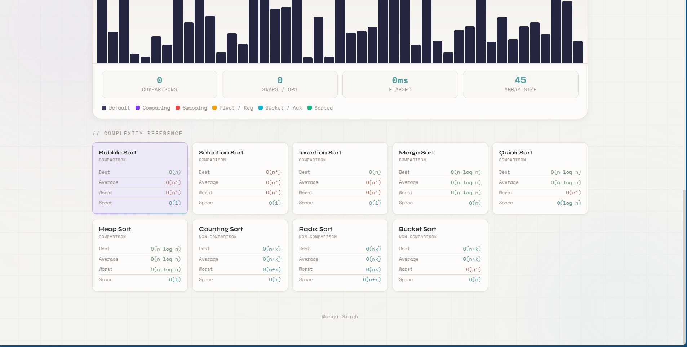
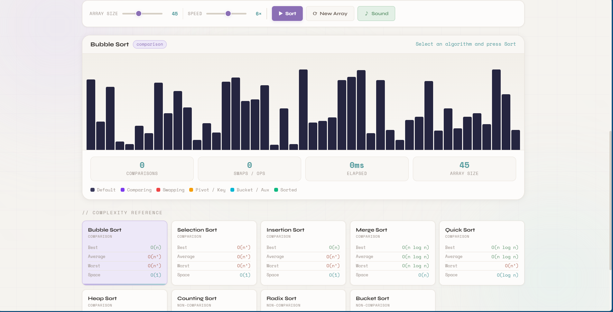

<div class="container">

# Sorting Visualizer — Interactive Algorithm Animation Platform

Interactive sorting algorithm visualization platform featuring **real-time animated sorting**, **complexity analysis**, **sound synthesis**, and **comparison vs non-comparison sorting demonstrations**.

Built entirely with **Vanilla JavaScript**, focused on algorithm education, visualization systems, and asynchronous animation logic.


---

## Features

* **Real-Time Sorting Visualization** — Animated bar-based sorting system
* **9 Sorting Algorithms** — Comparison and non-comparison sorting support
* **Live Complexity Metrics** — Tracks comparisons, swaps, and execution statistics
* **Sound Synthesis Integration** — Web Audio API-powered operation feedback
* **Complexity Reference Dashboard** — Built-in algorithm complexity guide
* **Adjustable Simulation Controls** — Dynamic speed and array size tuning
* **Responsive Visualization Engine** — Desktop and mobile compatible
* **Zero Dependencies** — Pure HTML, CSS, and JavaScript implementation

---

## Screenshots

### Main Dashboard



### Algorithm Animation



### Complexity Reference Panel



---

## Implemented Algorithms

### Comparison Sorting

* Bubble Sort
* Selection Sort
* Insertion Sort
* Merge Sort
* Quick Sort
* Heap Sort

### Non-Comparison Sorting

* Counting Sort
* Radix Sort
* Bucket Sort

---

## Performance Analysis

Tracks during runtime:

* Total comparisons
* Swap operations
* Execution time
* Current array size
* Visualization state changes

---

## Visualization Features

* Animated bar comparisons
* Swap highlighting
* Pivot/key highlighting
* Sorted-state visualization
* Adjustable sorting speed
* Dynamic array generation
* Real-time rendering updates

---

## Complexity Reference System

Includes built-in educational panels for:

* Time complexity analysis
* Space complexity comparison
* Stable vs unstable sorting
* Comparison vs non-comparison sorting
* Best / average / worst-case scenarios

---

## Sound Synthesis

Optional sound feedback generated using the **Web Audio API**.

Features:

* Real-time operation tones
* Frequency variation by bar height
* Toggleable sound system
* Lightweight audio engine

---

## Tech Stack

| Layer        | Technology                   |
| ------------ | ---------------------------- |
| Frontend     | HTML5                        |
| Styling      | CSS3                         |
| Logic Engine | Vanilla JavaScript (ES6)     |
| Audio        | Web Audio API                |
| Rendering    | DOM-based animation system   |
| Architecture | Modular visualization engine |

---

## Project Structure

```bash id="ln0f4k"
sorting-visualizer/
├── index.html
├── style.css
├── script.js
├── screenshots/
│   ├── sorting.png
│   ├── sorting-algo.png
│   └── complexity-ref.png
└── README.md
```

---

## Getting Started

### Prerequisites

* Modern web browser
* VS Code Live Server (optional)

### Installation

```bash id="l9hltr"
# 1. Clone the repository
git clone https://github.com/YOUR_USERNAME/sorting-visualizer.git

# 2. Enter project directory
cd sorting-visualizer
```

### Run Locally

Open:

```bash id="0xtlt7"
index.html
```

Or use VS Code Live Server.

---

## How It Works

```text id="9n0c0v"
Array Generation
        ↓
Algorithm Selection
        ↓
Comparison + Swap Operations
        ↓
DOM Visualization Rendering
        ↓
Metrics + Audio Feedback Updates
```

---

## File Overview

### `index.html`

Contains:

* Visualization layout
* Algorithm controls
* Metrics dashboard
* Educational theory section
* Complexity reference cards

---

### `style.css`

Handles:

* Cyber-glass UI styling
* Animated grid background
* Visualization themes
* Bar animations
* Responsive layout behavior

---

### `script.js`

Core visualization and sorting engine.

Includes:

* Array generation
* Rendering logic
* Async sorting animations
* Complexity tracking
* Sound synthesis
* Metrics updates

---

## Concepts Demonstrated

* Data Structures & Algorithms
* Sorting Systems
* Algorithm Visualization
* Async JavaScript Execution
* DOM Animation Logic
* Complexity Analysis
* Web Audio API Integration
* Interactive UI Engineering

---

## Browser Support

| Browser     | Support   |
| ----------- | --------- |
| Chrome 90+  | Supported |
| Firefox 88+ | Supported |
| Safari 14+  | Supported |
| Edge 90+    | Supported |

---

## Future Improvements

* Graph complexity plotting
* Side-by-side algorithm race mode
* Custom array input
* Searching algorithm visualizers
* Shell Sort support
* TimSort implementation
* WebAssembly optimization
* Canvas-based rendering engine

---

## Technical Highlights

### Async Animation Engine

Sorting algorithms are executed asynchronously using timed rendering cycles to visualize each operation step-by-step.

### Visualization Pipeline

Each operation updates:

* Active comparison state
* Swap state
* Sorted state
* Metrics dashboard
* Audio feedback engine

### Sound Mapping System

Bar heights dynamically map to oscillator frequencies for real-time algorithm sonification.

---

## License

MIT © Manya Singh
